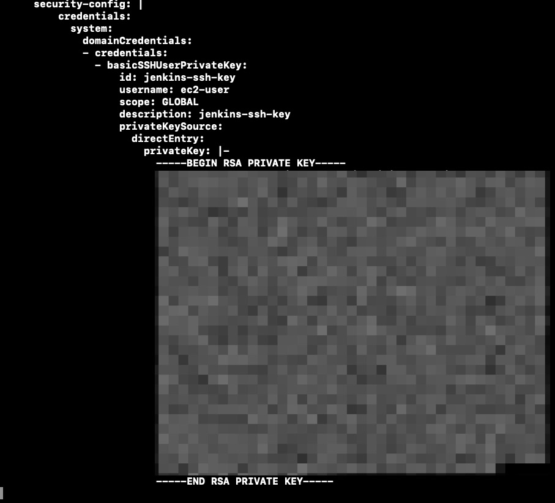
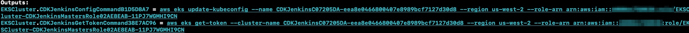
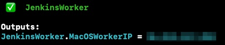
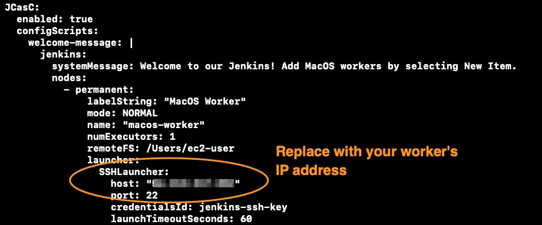
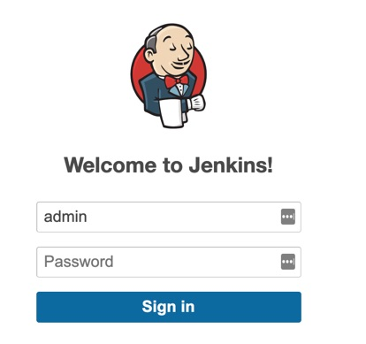
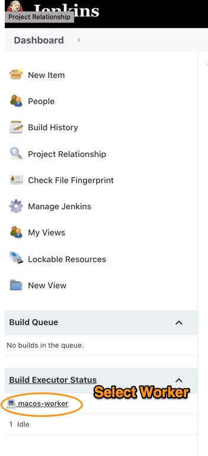
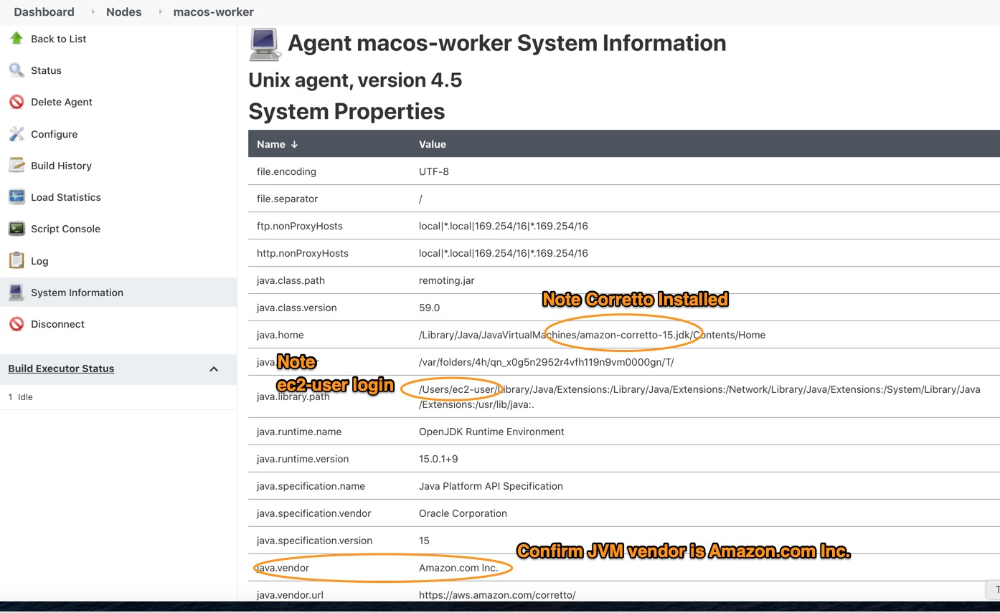

# Integrating EC2 MacOS Workers with EKS and Jenkins

## What is this?

This project will build and deploy a new VPC with an EKS cluster, deploy a fault tolerant instance of Jenkins, provision a MacOS EC2 instance, add the instance as a worker to Jenkins, and create an S3 bucket that uses a least privileges security model with access from only the Jenkins’s worker. This project is leveraging the Jenkins Configuration as Code [plugin](https://jenkins.io/projects/jcasc/) to automate the Jenkins platform.

## Why?

Getting a stable build environment up and running requires a lot of steps and this approach automates the entire process. Please note that this is an **example** and should be used as a guide for your site reliability engineering teams to develop their own production deployment. TLS is not enabled with this code but it could be added later to the load balancer.

## Requirements

To deploy this environment, you will need to install [aws-cdk](https://docs.aws.amazon.com/cdk/latest/guide/getting_started.html#getting_started_install) and have the AWS CLI [installed](https://docs.aws.amazon.com/cli/latest/userguide/install-cliv2.html) and [configured](https://docs.aws.amazon.com/cli/latest/userguide/cli-configure-quickstart.html). Additionally, ensure that you have kubectl [installed](https://kubernetes.io/docs/tasks/tools/install-kubectl/) to work with your EKS cluster.

## Allocate Mac1 EC2 Hosts

After ensuring the AWS CLI is installed and configured, you will need to first allocate an ec2 Mac1 host in your region of choice. In the example below we are using us-west-2.

```
bash$ aws ec2 allocate-hosts --instance-type mac1.metal \
  --availability-zone us-west-2a --auto-placement on \
  --quantity 1 --region us-west-2
```

## Configure SSH Key for Workers

You will need to [create an SSH key](https://docs.aws.amazon.com/AWSEC2/latest/UserGuide/ec2-key-pairs.html) in the AWS console. Give it a name like “jenkins-key”

Clone this repo to a directory of your choosing and change into that directory.

```
bash$ git clone git@github.com:aws-samples/mac1-eks-jenkins.git
bash$ cd mac1-eks-jenkins
```

Once you have the key created you will need to edit the Jenkins Configuration as Code ./lib/manifests/jenkins-values.yaml file and add your private key there. The private key is uploaded to the Jenkins leader so it can SSH into the MacOS worker.

Under the security-config parameter, add your private key here that was generated.

```
bash$ vi ./lib/manifests/jenkins-values.yaml
# Add your key under the "privateKey: |-" line. Include the BEGIN and END lines
# found in your key file.
```



## Instantiating EKS, Jenkins, MacOS, and an S3 Bucket

Now that you have configured the AWS CLI, AWS CDK, and generated your SSH key you are ready to begin launching the build environment.

First, we’re going to choose the Region we want to launch this environment into by setting an environmental variable for CDK.

```
bash$ export CDK_DEFAULT_REGION=us-west-2
```

Install the CDK dependencies.

```
bash$ npm install
```

Let’s confirm the stacks that will be deployed.

```
bash$ cdk list
EKSCluster
JenkinsBucket
JenkinsHelm
JenkinsWorker
```

### Creating the EKS Cluster

Provisioning an EKS cluster takes about 20 minutes so after you run the command below feel free to grab a coffee then come back and check on your deployment.

```
bash$ cdk deploy EKSCluster
```

Note the outputs that are generated. Run the commands to get your kubectl environment correctly configured.



From the outputs, you want to run the aws eks update-kubeconfig and aws eks get-token commands to properly setup your kubeconfig.

### Creating the S3 Bucket for Artifacts

```
bash$ cdk deploy JenkinsBucket
```

### Creating the MacOS Jenkins Worker

Launch the Jenkins CDK stack and note the IP address of the worker.

```
bash$ cdk deploy JenkinsWorker
```



### Creating the Jenkins Leader

Once again, we’re going to need to update the Jenkins Configuration as Code YAML file to ensure our worker is successfully added. Please enter the IP address that was outputted from the JenkinsWorker stack in the “host:” parameter highlighted below.

```
bash$ vi ./lib/manifests/jenkins-values.yaml
```



It takes about 4-5 minutes for this stack to complete.

```
bash$ cdk deploy JenkinsHelm
```

Once this stack is complete run the following commands to login to your Jenkins environment.

**Note: If you get an error running this stack just re-run it. There is a known issue with CDK and Helm that is actively being [addressed](https://github.com/aws/aws-cdk/issues/8713).**

Get your Jenkins autogenerated password stored as a Kubernetes secret.

```
bash$ printf $(kubectl get secret --namespace jenkins cicd-jenkins -o jsonpath="{.data.jenkins-admin-password}" | base64 --decode);echo
```

Get the URL to your Jenkins installation.

```
bash$ kubectl get svc --namespace jenkins cicd-jenkins --template "{{ range (index .status.loadBalancer.ingress 0) }}{{ . }}{{ end }}"
```

### Logging into Jenkins

Now that you have captured the admin password from Kubernetes secrets and the load balancer endpoint you can login to Jenkins. Place the URL for the Jenkins install into Chrome or Safari and login.



Once you have logged into Jenkins look to confirm that your MacOS worker is connected.



Confirm details that the MacOS worker is working.



Now that your Jenkins worker has been configured and added you can begin creating Jenkins pipelines or other automated tasks.
